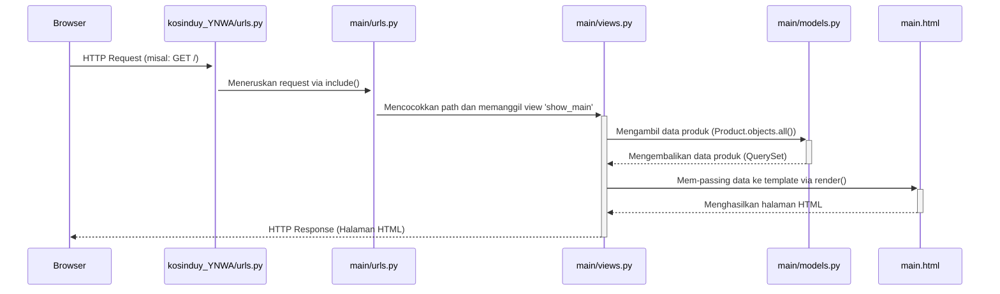

# kosinduy_YNWA

**Jelaskan bagaimana cara kamu mengimplementasikan checklist di atas secara step-by-step (bukan hanya sekadar mengikuti tutorial).**
Implementasi proyek dimulai dengan membuat kerangka proyek Django menggunakan django-admin startproject kosinduy_YNWA dan aplikasi main dengan python manage.py startapp main. Setelah itu, saya melakukan beberapa konfigurasi: di kosinduy_YNWA/settings.py, saya mendaftarkan aplikasi baru dengan menambahkan 'main' ke dalam list INSTALLED_APPS. Selanjutnya, pada file kosinduy_YNWA/urls.py, saya mengimpor include dan menambahkan path('', include('main.urls')) untuk melakukan routing ke aplikasi main. Di dalam aplikasi main, saya membuat file urls.py baru dan mendefinisikan path('', show_main, name='show_main') untuk memetakan URL root ke view yang sesuai. Pada main/models.py, saya membuat class Product(models.Model) dan mendefinisikan semua atribut, yaitu: name dengan tipe CharField, price dengan tipe IntegerField, description dengan tipe TextField, thumbnail dengan tipe URLField, category dengan tipe CharField, is_featured dengan tipe BooleanField, dan stock dengan tipe PositiveIntegerField. Kemudian, di main/views.py, saya membuat fungsi show_main yang mengimpor model Product, mengambil semua datanya melalui Product.objects.all(), dan mengirimkannya dalam sebuah context ke template. Saya juga membuat direktori main/templates/ dan file main.html di dalamnya, yang saya isi dengan kode HTML dan sintaks Django untuk menampilkan data produk secara dinamis. Terakhir, untuk persiapan deployment, saya membuat file requirements.txt, mengkonfigurasi .env.prod dengan kredensial PWS, dan menyesuaikan settings.py untuk ALLOWED_HOSTS serta database produksi yang digunakan.

**Buatlah bagan yang berisi request client ke web aplikasi berbasis Django beserta responnya dan jelaskan pada bagan tersebut kaitan antara urls.py, views.py, models.py, dan berkas html.**
Alur request-response di aplikasi saya adalah sebagai berikut:
1. Client (Browser) mengirim request ke URL.
2. kosinduy_YNWA/urls.py menerima request dan meneruskannya ke main/urls.py.
3. main/urls.py mencocokkan URL dengan pola yang ada dan memanggil fungsi show_main di views.py.
4. views.py (fungsi show_main) berinteraksi dengan models.py untuk mengambil data semua produk dari database (Product.objects.all()).
5. views.pykemudian mengirimkan data tersebut ke main.html.
6. Template main.html me-render data menjadi halaman HTML yang utuh.
7. Halaman HTML tersebut dikirim kembali sebagai response ke Client.

Kaitannya adalah urls.py bertindak sebagai pemetaan URL yang mengarahkan request ke views.py. Kemudian, views.py berfungsi sebagai otak yang memproses logika, berinteraksi dengan models.py untuk mengelola data, dan memilih html template yang sesuai untuk ditampilkan. Terakhir, berkas .html adalah lapisan presentasi yang menerima data dari view dan menampilkannya kepada pengguna.

**Jelaskan peran settings.py dalam proyek Django!**
'settings.py' adalah file konfigurasi utama proyek Django. Perannya adalah sebagai pusat kendali di mana saya mengatur semua hal penting, seperti mendaftarkan aplikasi di 'INSTALLED_APPS', mengkonfigurasi koneksi database di 'DATABASES', menyimpan 'SECRET_KEY' untuk keamanan, mengatur mode 'DEBUG', dan mendaftarkan 'ALLOWED_HOST' yang diizinkan mengakses aplikasi.

**Bagaimana cara kerja migrasi database di Django?**
Migrasi database di Django bekerja dalam dua langkah. Pertama, 'python manage.py makemigrations' akan menyimpan perubahan pada models.py dan membuat file rencana migrasi di directory migrations (0001_initial.py etc). File ini berisi instruksi tentang perubahan yang akan dilakukan pada database. Kedua, 'python manage.py migrate' akan mengeksekusi rencana tersebut dan menerapkan perubahan pada struktur database yang sebenarnya. Proses ini memastikan perubahan database dilakukan secara aman dan terkontrol dengan pertama menyimpan blueprint kemudian baru menerapkannya.

**Menurut Anda, dari semua framework yang ada, mengapa framework Django dijadikan permulaan pembelajaran pengembangan perangkat lunak?**
Menurut saya, Django adalah pilihan yang sangat tepat untuk memulai belajar pengembangan perangkat lunak/web.
Django adalah framework yang sangat lengkap. Terdapat banyak fitur penting yang sudah tersedia langsung untuk digunakan sehingga tidak perlu repot mencari dan memasang fitur tambahan tambahan. Contohnya adalah panel admin bawaan Django yang bisa dibuat otomatis untuk mengelola data dan sistem untuk berinteraksi dengan database menggunakan Python (ORM) yang lebih intuitif dari menulis SQL. Ini membuat pemula bisa fokus memahami alur kerja pengembangan web, tidak terjebak di aspek teknis pemasangan komponen.
Selain itu, Django menggunakan bahasa Python yang dikenal sebagai bahasa yang mudah dipelajari karena sintaksnya yang sederhana dan mudah dibaca. Terutama di Fasilkom UI, Python merupakan bahasa pemrograman pertama yang diajarkan sehingga rata-rata mahasiswa paling mahir menggunakan python dibanding bahasa pemrograman lain. Dengan itu, keterampilan pemrograman rata-rata mahasiswa Fasilkom UI sudah cukup untuk membangun aplikasi web menggunakan Python (Django). Jadi, proses belajar tidak terlalu berat karena tidak perlu mempelajari bahasa dan framework baru di saat yang bersamaan.

**Apakah ada feedback untuk asisten dosen tutorial 1 yang telah kamu kerjakan sebelumnya?**
Saya ingin mengucapkan terima kasih kak sudah membantu selama tutorial, walaupun terkadang pertanyaannya agak konyol 😅. Penjelasannya kakak-kakak asdos sangat jelas dan mudah diikuti. Untuk kedepannya, mungkin penjelasan lebih dalam mengenai cara kerja program/apa yang dilakukan kode yang baru kita tulis bisa diberi penjelasan karena setelah kelas saya banyak mencari tahu sendiri. Selain itu, best practice dalam penulisan kode Django juga boleh diberikan ke kita. Terima Kasih Kak!