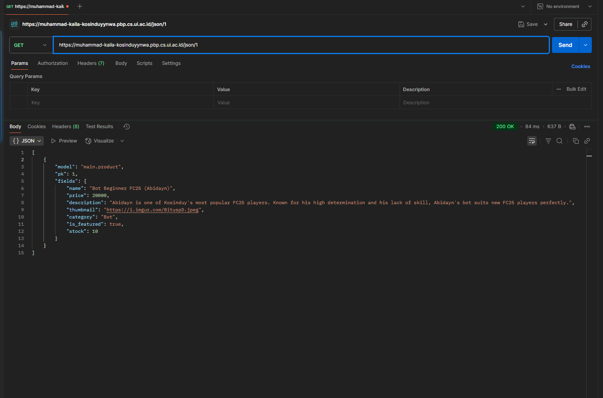

# TUGAS 2

**Jelaskan bagaimana cara kamu mengimplementasikan checklist di atas secara step-by-step (bukan hanya sekadar mengikuti tutorial).**

Implementasi proyek dimulai dengan membuat kerangka proyek Django menggunakan django-admin startproject kosinduy_YNWA dan aplikasi main dengan python manage.py startapp main. Setelah itu, saya melakukan beberapa konfigurasi: di kosinduy_YNWA/settings.py, saya mendaftarkan aplikasi baru dengan menambahkan 'main' ke dalam list INSTALLED_APPS. Selanjutnya, pada file kosinduy_YNWA/urls.py, saya mengimpor include dan menambahkan path('', include('main.urls')) untuk melakukan routing ke aplikasi main. Di dalam aplikasi main, saya membuat file urls.py baru dan mendefinisikan path('', show_main, name='show_main') untuk memetakan URL root ke view yang sesuai. Pada main/models.py, saya membuat class Product(models.Model) dan mendefinisikan semua atribut, yaitu: name dengan tipe CharField, price dengan tipe IntegerField, description dengan tipe TextField, thumbnail dengan tipe URLField, category dengan tipe CharField, is_featured dengan tipe BooleanField, dan stock dengan tipe PositiveIntegerField. Kemudian, di main/views.py, saya membuat fungsi show_main yang mengimpor model Product, mengambil semua datanya melalui Product.objects.all(), dan mengirimkannya dalam sebuah context ke template. Saya juga membuat direktori main/templates/ dan file main.html di dalamnya, yang saya isi dengan kode HTML dan sintaks Django untuk menampilkan data produk secara dinamis. Terakhir, untuk persiapan deployment, saya membuat file requirements.txt, mengkonfigurasi .env.prod dengan kredensial PWS, dan menyesuaikan settings.py untuk ALLOWED_HOSTS serta database produksi yang digunakan.

**Buatlah bagan yang berisi request client ke web aplikasi berbasis Django beserta responnya dan jelaskan pada bagan tersebut kaitan antara urls.py, views.py, models.py, dan berkas html.**

Alur request-response di aplikasi saya adalah sebagai berikut:
1. Client (Browser) mengirim request ke URL.
2. kosinduy_YNWA/urls.py menerima request dan meneruskannya ke main/urls.py.
3. main/urls.py mencocokkan URL dengan pola yang ada dan memanggil fungsi show_main di views.py.
4. views.py (fungsi show_main) berinteraksi dengan models.py untuk mengambil data semua produk dari database (Product.objects.all()).
5. views.pykemudian mengirimkan data tersebut ke main.html.
6. Template main.html me-render data menjadi halaman HTML yang utuh.
7. Halaman HTML tersebut dikirim kembali sebagai response ke Client.

Kaitannya adalah urls.py bertindak sebagai pemetaan URL yang mengarahkan request ke views.py. Kemudian, views.py berfungsi sebagai otak yang memproses logika, berinteraksi dengan models.py untuk mengelola data, dan memilih html template yang sesuai untuk ditampilkan. Terakhir, berkas .html adalah lapisan presentasi yang menerima data dari view dan menampilkannya kepada pengguna.

**Jelaskan peran settings.py dalam proyek Django!**

'settings.py' adalah file konfigurasi utama proyek Django. Perannya adalah sebagai pusat kendali di mana saya mengatur dan mengkonfigurasi semua hal penting, seperti mendaftarkan aplikasi di 'INSTALLED_APPS', mengkonfigurasi koneksi database di 'DATABASES', menyimpan 'SECRET_KEY' untuk keamanan, mengatur mode 'DEBUG', dan mendaftarkan 'ALLOWED_HOST' yang diizinkan mengakses aplikasi.

**Bagaimana cara kerja migrasi database di Django?**

Migrasi database di Django bekerja dalam dua langkah. Pertama, 'python manage.py makemigrations' akan menyimpan perubahan pada models.py dan membuat file rencana migrasi di directory migrations (0001_initial.py etc). File ini berisi instruksi tentang perubahan yang akan dilakukan pada database. Kedua, 'python manage.py migrate' akan mengeksekusi rencana tersebut dan menerapkan perubahan pada struktur database yang sebenarnya. Proses ini memastikan perubahan database dilakukan secara aman dan terkontrol dengan pertama menyimpan blueprint kemudian baru menerapkannya.

**Menurut Anda, dari semua framework yang ada, mengapa framework Django dijadikan permulaan pembelajaran pengembangan perangkat lunak?**

Menurut saya, Django adalah pilihan yang sangat tepat untuk memulai belajar pengembangan perangkat lunak/web.
Django adalah framework yang sangat lengkap. Terdapat banyak fitur penting yang sudah tersedia langsung untuk digunakan sehingga tidak perlu repot mencari dan memasang fitur tambahan tambahan. Contohnya adalah panel admin bawaan Django yang bisa dibuat otomatis untuk mengelola data dan sistem untuk berinteraksi dengan database menggunakan Python (ORM) yang lebih intuitif dari menulis SQL. Ini membuat pemula bisa fokus memahami alur kerja pengembangan web, tidak terjebak di aspek teknis pemasangan komponen.
Selain itu, Django menggunakan bahasa Python yang dikenal sebagai bahasa yang mudah dipelajari karena sintaksnya yang sederhana dan mudah dibaca. Terutama di Fasilkom UI, Python merupakan bahasa pemrograman pertama yang diajarkan sehingga rata-rata mahasiswa paling mahir menggunakan python dibanding bahasa pemrograman lain. Dengan itu, keterampilan pemrograman rata-rata mahasiswa Fasilkom UI sudah cukup untuk membangun aplikasi web menggunakan Python (Django). Jadi, proses belajar tidak terlalu berat karena tidak perlu mempelajari bahasa dan framework baru di saat yang bersamaan.

**Apakah ada feedback untuk asisten dosen tutorial 1 yang telah kamu kerjakan sebelumnya?**

Saya ingin mengucapkan terima kasih kak sudah membantu selama tutorial, walaupun terkadang pertanyaannya agak konyol 😅. Penjelasannya kakak-kakak asdos sangat jelas dan mudah diikuti. Untuk kedepannya, mungkin penjelasan lebih dalam mengenai cara kerja program/apa yang dilakukan kode yang baru kita tulis bisa diberi penjelasan karena setelah kelas saya banyak mencari tahu sendiri. Selain itu, best practice dalam penulisan kode Django juga boleh diberikan ke kita. Terima Kasih Kak!

# TUGAS 3

**Jelaskan mengapa kita memerlukan data delivery dalam pengimplementasian sebuah platform?**

Data delivery diperlukan agar data yang tersimpan di server dapat dikirim dan diakses oleh client (seperti aplikasi web atau mobile) secara efisien. Dengan adanya data delivery, client bisa mendapatkan data terbaru dari server, menampilkan informasi yang relevan kepada pengguna, dan melakukan sinkronisasi data antar perangkat. Tanpa mekanisme data delivery, aplikasi hanya akan bersifat statis dan tidak bisa menampilkan data dinamis atau melakukan interaksi dua arah antara client dan server.

**Menurutmu, mana yang lebih baik antara XML dan JSON? Mengapa JSON lebih populer dibandingkan XML?**

Menurut saya, JSON lebih baik untuk kebanyakan aplikasi modern karena formatnya lebih sederhana, mudah dibaca manusia, dan langsung bisa diproses oleh JavaScript di browser tanpa parsing tambahan. JSON juga menghasilkan data yang lebih ringkas sehingga lebih hemat bandwidth. Sementara itu, XML memang lebih fleksibel dan bisa digunakan untuk validasi data yang kompleks, tetapi sintaksnya lebih rumit dan ukuran file biasanya lebih besar. Karena alasan kemudahan penggunaan dan efisiensi, JSON menjadi standar utama untuk pertukaran data di web saat ini.

**Jelaskan fungsi dari method is_valid() pada form Django dan mengapa kita membutuhkan method tersebut?**

Method is_valid() pada form Django digunakan untuk melakukan validasi otomatis terhadap data yang diinputkan user, sesuai dengan aturan yang sudah didefinisikan di form atau model. Jika data yang dikirim user tidak sesuai (misal: format email salah, field wajib kosong, dsb), maka form akan dianggap tidak valid dan error bisa ditampilkan ke user. Dengan is_valid(), kita memastikan hanya data yang benar dan aman yang akan diproses atau disimpan ke database.

**Mengapa kita membutuhkan csrf_token saat membuat form di Django? Apa yang dapat terjadi jika kita tidak menambahkan csrf_token pada form Django? Bagaimana hal tersebut dapat dimanfaatkan oleh penyerang?**

csrf_token dibutuhkan untuk melindungi aplikasi dari serangan Cross-Site Request Forgery (CSRF), yaitu serangan di mana penyerang mencoba memanfaatkan sesi login user untuk mengirimkan permintaan palsu ke server tanpa sepengetahuan user. Jika kita tidak menambahkan csrf_token pada form, penyerang bisa membuat user yang sedang login tanpa sadar melakukan aksi berbahaya seperti mengubah data, menghapus akun, atau transaksi ilegal hanya dengan mengunjungi website lain. Dengan adanya csrf_token, server bisa memastikan setiap permintaan POST benar-benar berasal dari form yang sah di aplikasi kita, sehingga serangan CSRF bisa dicegah.

**Jelaskan bagaimana cara kamu mengimplementasikan checklist di atas secara step-by-step (bukan hanya sekadar mengikuti tutorial).**

Saya mulai dengan menambahkan empat fungsi baru di views.py, yaitu fungsi untuk menampilkan data produk dalam format XML, JSON, XML by ID, dan JSON by ID. Masing-masing fungsi ini menggunakan modul serializers dari Django untuk mengubah queryset produk menjadi format XML atau JSON, lalu mengembalikannya sebagai response. Untuk fungsi by ID, saya menggunakan filter berdasarkan primary key agar hanya data produk tertentu yang diambil. Selain itu, saya juga menambahkan fungsi add_product untuk menangani form penambahan produk baru ke database, serta fungsi show_product untuk menampilkan detail dari setiap produk berdasarkan ID-nya. Setelah itu, saya membuat file forms.py dan mendefinisikan sebuah class form berbasis ModelForm untuk model Product. Dengan form ini, saya bisa membuat halaman tambah produk yang otomatis sudah ada validasi dan field-nya sesuai dengan model.

Saya kemudian membuat template dasar base.html yang berisi struktur HTML utama (seperti tag <html>, <head>, dan <body>) serta block konten yang bisa di-extend oleh template lain. Supaya Django bisa menemukan template ini, saya menambahkan konfigurasi direktori template di settings.py dengan menambahkan path ke folder templates pada bagian DIRS di variabel TEMPLATES. Selanjutnya, saya menambahkan dua file template baru, yaitu create_product.html untuk halaman form tambah produk dan product_detail.html untuk menampilkan detail produk. Pada create_product.html, saya menggunakan  dan menampilkan form yang sudah dibuat di forms.py. Pada product_detail.html, saya juga extend dari base.html dan menampilkan detail lengkap dari produk yang dipilih. Selain itu, saya juga mengedit template main.html agar menampilkan tombol "Add Product" yang mengarah ke halaman tambah produk, serta menambahkan tombol "More Detail" pada setiap div produk yang akan mengarahkan ke halaman detail produk tersebut.

Terakhir, saya menambahkan routing baru di urls.py untuk menghubungkan setiap fungsi view yang sudah dibuat tadi dengan URL yang sesuai. Saya menambahkan path untuk halaman utama, tambah produk, detail produk, serta empat path tambahan untuk akses data produk dalam format XML, JSON, XML by ID, dan JSON by ID.

**Apakah ada feedback untuk asdos di tutorial 2 yang sudah kalian kerjakan?**

Menurut saya tidak ada feedback lebih lanjut dari tutorial 1. Saya sangat merasa terbantu ketika bertanya dan tutorial yang ada juga sudah sangat jelas dan informatif. Mungkin saya bisa sebutkan terkait demo tugas yang awalnya saya kira akan sangat tegang karena pemahaman saya yang mungkin masih terbatas, tetapi ternyata saya lumayan paham dan kak Isa baik juga 😁.

**  Mengakses keempat URL di poin 2 menggunakan Postman, membuat screenshot dari hasil akses URL pada Postman**

